# ProConnect User Guide

[Website Link](https://proconnect-6173c.web.app/ "ProConnect Website")

[Android APK](github.com/hadiDanial/ProConnect/blob/main/ProConnect.apk "Android APK")

### About

ProConnect is a platform designed to give professionals and homeowners tools to interact with each other, giving professionals more business opportunities and homeowners the chance to find skilled and trusted professionals to do work on their properties.

### Authentication

To get started, you must first create an account and sign in. As soon as you open the website or launch the app, you get directed to the login page, where you can also sign up for a new account. You can also reset your password if you forgot your login information.

[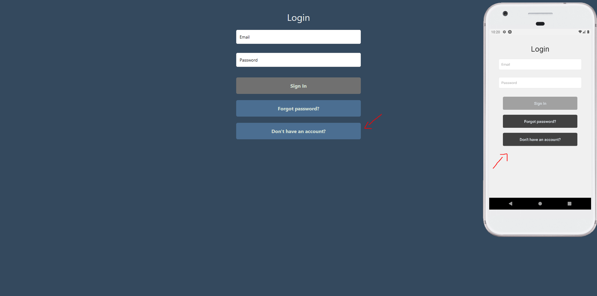](./UserGuideImages/Login.PNG)

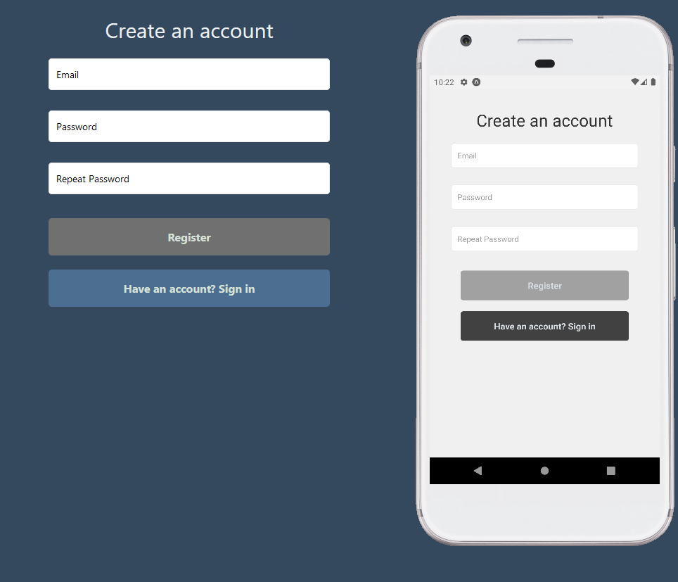

### Profile Setup

After you sign up, you'll get redirected to the profile setup page, where you can customize your profile picture, contact information, location and account type (Homeowner or Professional). The account type cannot be changed afterwards, but everything else can.

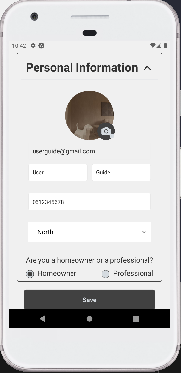

If you choose a professional account, you'll also have to choose your profession, how long you've been working in that professsion, and enter which services you offer, which will help homeowners get a better understanding of your skillset.

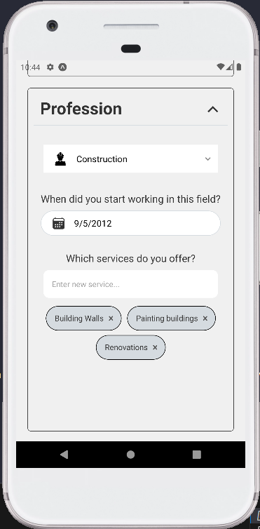

### Home Page

After finishing the profile setup, you'll be redirected to the home page, where you can look for professionals in different professions and look at articles.

Notice the side bar, which you can open by clicking on the hamburger menu on mobile and is always visible on web, where you can either go to your profile, change your theme preference, log out, or go back to the home page.

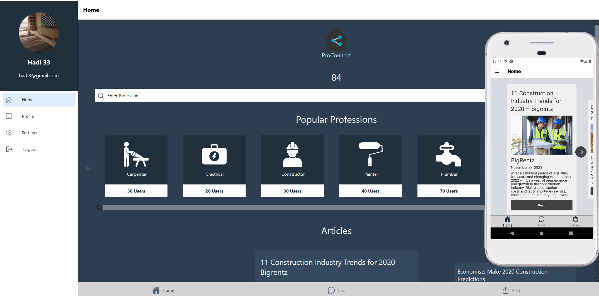

Notice that Homeowner accounts have a Post tab on the bottom navigation bar, while Professionals have a Jobs tab.

#### Navigation Tab Bar

The navigation tab bar contains three tabs:

1. Home, which we've already seen.
2. Chat, a page where you can see all the chats you've had and access the conversations, and
3. Either a Post tab or a Jobs tab
   * **Homeowners:** Homeowners have access to the Post tab, where they can publish new posts about jobs they require help with
   * **Professionals:** Professionals have access to the Jobs tab, where they can browse through posts in their particular profession and look for something they'd like to work on.

#### Profession Search Bar

At the top of the Home page, you'll find a search bar where you can enter your desired profession and look for professionals in that profession in the "Find Professionals" page.

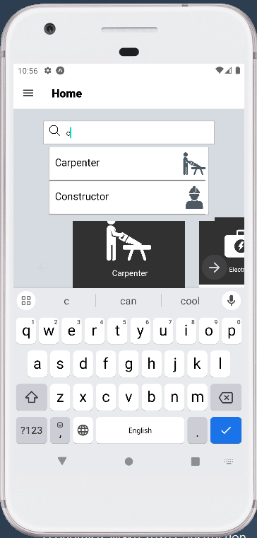

### Find Professionals Page

In this page, you'll find relevant professionals in your area, with information such as name, experience, and their average rating. You can also filter and sort by years of experience or rating, and you can search for a particular professional if you happen to know their name.

Clicking on one of these professionals will open up a Chat conversation with them, while clicking on their profile picture will open up their profile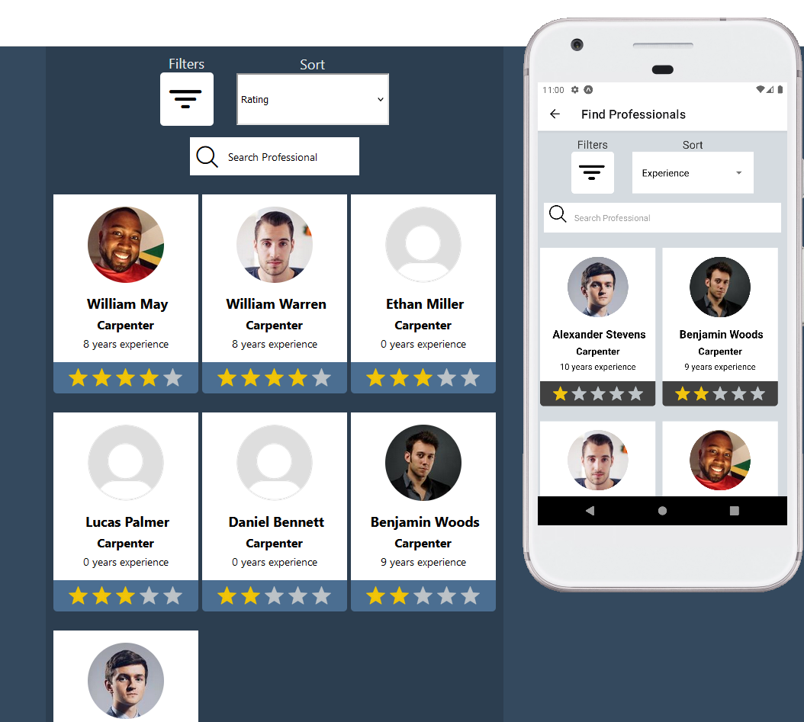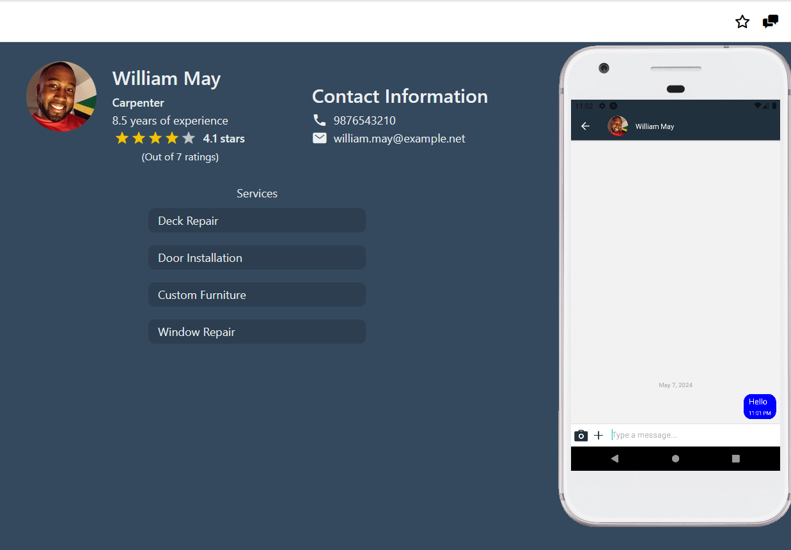

Notice that you can navigate from the chat screen to the profile and from the profile to the chat at any time.

### Profile

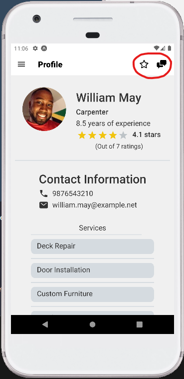

When viewing another user's profile, you'll be able to see information about the user such as contact information, rating, as well as their profession, services and experience in the case that they are a professional user. You'll also notice that you can open a chat conversation or rate the user from the top right corner of the profile.

When viewing your own profile, however, instead you'll see an edit button which will take you back to the profile setup page where you can change any of your information

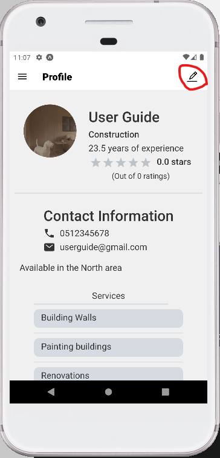

As for Homeowner profiles, you can see a list of the jobs they have available at the moment.

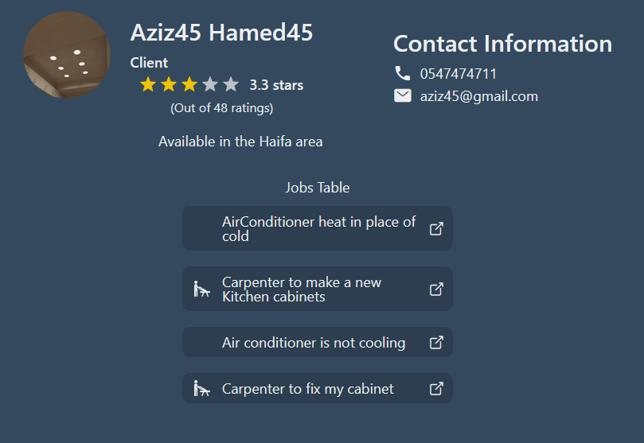

### Post Job Screen

Homeowners have access to a Post Job screen, where they can post new jobs. This has three steps:

1. Set a title, budget, and select a profession.
2. Enter a description of the issue or job.
3. Add pictures (optional)
4. 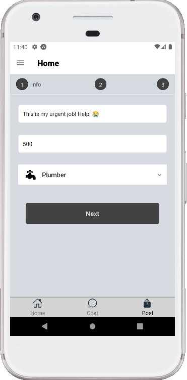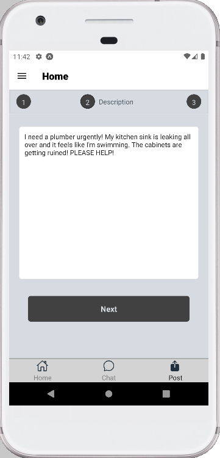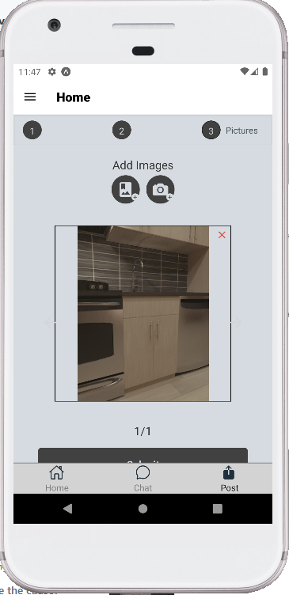

### Jobs

Professionals can browse relevant available jobs in the Jobs tab, seeing details such as the job title, description, poster, and any pictures that the poster might have included, and from there they can send an offer to the job poster or start up a conversation with them.

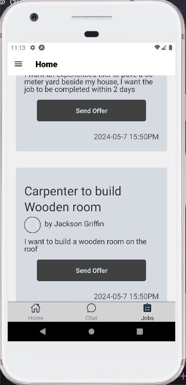

When clicking on the send offer button, the professional gets presented with a modal they can use to send a simple message with an offer, or they can just move on to the chat page.

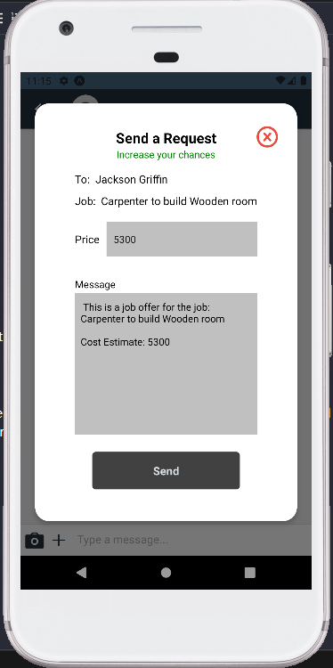

### Chat

In the chat page, you can talk to the other user, send them pictures or contacts, and negotiate terms and offers.

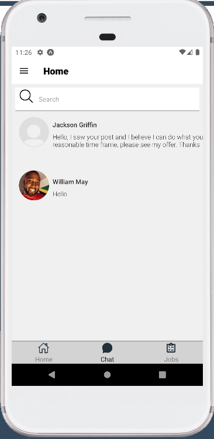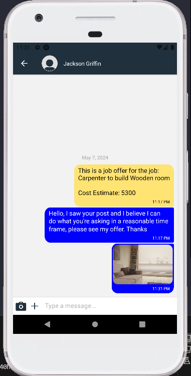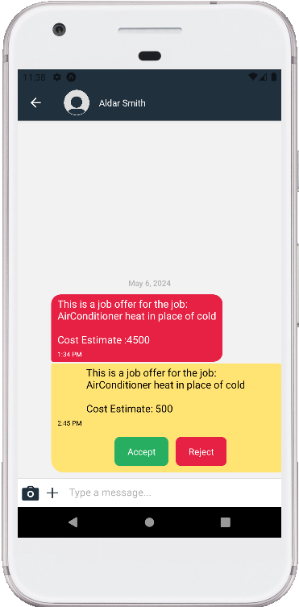
